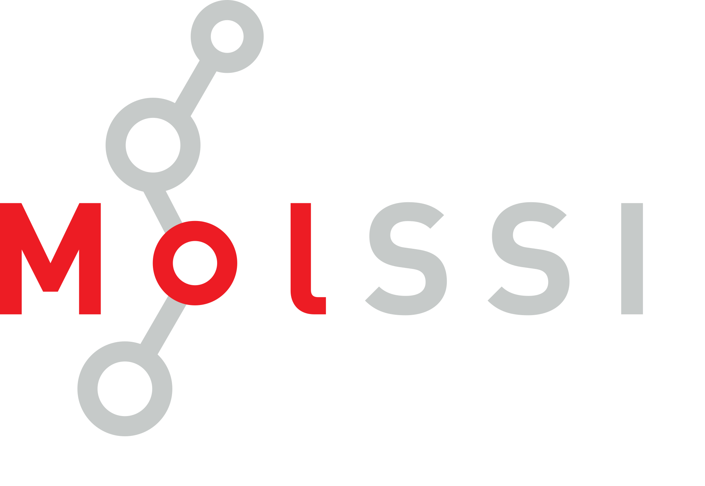

# MolSSI Brand Guidelines

## Logos
The MolSSI brand consists of the main MolSSI logo, and several variations which are associated with different projects.

### Main MolSSI Logos
There are two MolSSI logos. The logo saying "MolSSI" should  be used for most MolSSI communications including websites, newsletters and presentations. The horizontal logo with the full name of the institute ("The Molecular Sciences Software Institute") is used as a for official MolSSI letterheads and business cards.

  MolSSI Logo #1 

  

  MolSSI Logo #2 

### Inverted MolSSI Logos
These versions of the logo should be used in media with dark backgrounds.

  MolSSI Logo #1 

  MolSSI Logo #2 

### Special MolSSI Logos

The MolSSI logo is modified for some special projects. The modification should be done to the "molecule" attached to the 'o' in MolSSI.

  Logo for the MolSSI Integral Reference Project  

  Logo for the MolSSI Education Programs  

  Logo for the MolSSI Cafe at HQ  

  Logo for the MolSSI Framework Project  

### Project Logos

This section is for MolSSI projects which have their own logos.

 QCArchive main logo  

## Acknowledging MolSSI Funding
Work funded by MolSSI should acknowledge NSF grant ACI-1547580 on all publications and presentations.

Software fellows publications might use:

> "`Software Fellow Name` was supported by a fellowship from The Molecular Sciences Software Institute under NSF grant ACI-1547580"

## Color Palette
The MolSSI color palette consists of black, gray, and red. The RGB and hex values of these colors are listed below.

 `#393536ff` / `RGB 57, 53, 54`

 `#ed1c24ff` / `RGB 237, 28, 36`

## Typography

MolSSI uses the fonts DIN and DIN Condensed. Both of these can be found in the fonts directory.

DIN Condensed is used for titles and the text in MolSSI main logo #2.

## Presentation Templates

### NSF Site Visit Poster Template
The poster template for the NSF site visit is `powerpoint_template/nsf_site_visit_template.pptx`. Please note that this template has the MolSSI logo, NSF logo (lower right corner), and a spot for the Software Fellow's institution logo (upper left corner). The fonts for this template are DIN and DIN Condensed, which can be found in in the `fonts` directory.

## HTML Email Signature Templates
