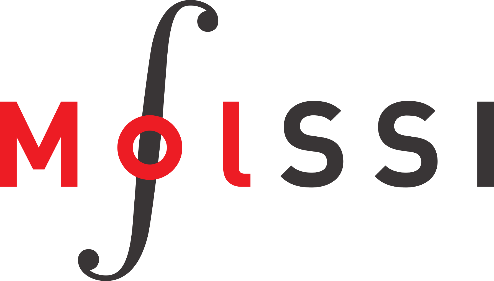

# MolSSI Brand Guidelines

## Logos
The MolSSI brand consists of the main MolSSI logo, and several variations which are associated with different projects.

### Main MolSSI Logos
There are two MolSSI logos. The logo saying "MolSSI" should  be used for most MolSSI communications including websites, newsletters and presentations. The horizontal logo with the full name of the institute ("The Molecular Sciences Software Institute") is used as a for official MolSSI letterheads and business cards.

  MolSSI Logo #1 

  

  MolSSI Logo #2 

### Special MolSSI Logos

The MolSSI logo is modified for some special projects. The modification should be done to the "molecule" attached to the 'o' in MolSSI.

  Logo for the MolSSI Integral Reference Project

## Color Palette
The MolSSI color palette consists of black, gray, and red. The RGB and hex values of these colors are listed below.

 `#393536ff`

 `#ed1c24ff`

## Typography

The font used for most text is Montserrat. 

DIN Condensed is used for titles and the text in MolSSI main logo #2. 

## Presentation Templates

## HTML Email Signature Templates
